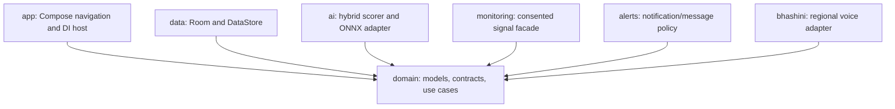
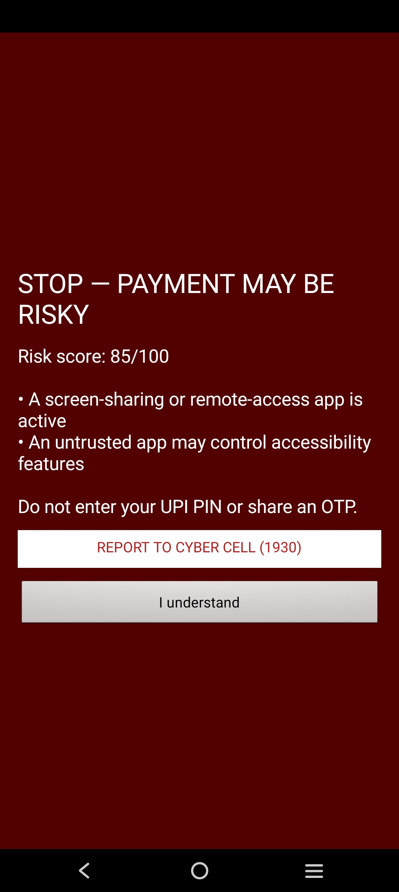
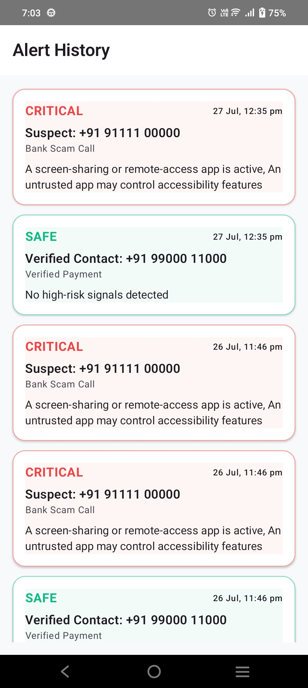
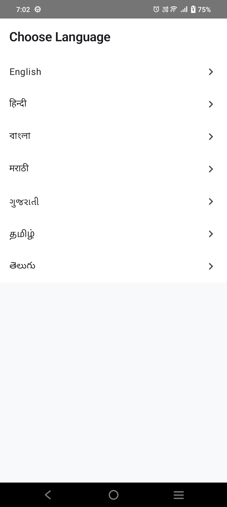

# 🛡️ GramKavach

[](https://kotlinlang.org)
[](https://developer.android.com)
[](https://opensource.org/licenses/MIT)
[](https://github.com/kgp134134-sys/GramKavach456/releases)

> **AI-powered digital financial safety assistant for preventing UPI fraud.**

---

## 📍 Table of Contents
- [📥 Download & Demo](#-download--demo)
- [📖 Overview](#-overview)
- [🧩 Problem and Solution](#-problem-and-solution)
- [🚀 Features](#-features)
- [🛠️ Tech Stack](#-tech-stack)
- [📐 Architecture](#-architecture)
- [⚙️ Installation](#-installation)
- [📱 In-App User Guide](#-in-app-user-guide)
- [📸 Screenshots](#-screenshots)
- [⚠️ ONNX Model Disclaimer](#-onnx-model-disclaimer)

---

## 📥 Download & Demo

**Get the latest hackathon-ready build here:**
[**Download GramKavach v0.3.0 APK**](https://github.com/kgp134134-sys/GramKavach456/releases/download/v0.3.0-stable/app-release.apk)

**Hackathon Highlights:**
- **Full Localization**: Support for 7+ Indian languages (Hindi, Marathi, Gujarati, Bengali, Tamil, Telugu, English).
- **Explainable AI**: Dynamic "Detection Analysis" table explaining risk scores.
- **Winner Dashboard**: Real-time pulsing risk gauge and safety status.

## 📖 Overview

GramKavach helps rural and first-time digital-payment users recognize fraud **before** they authorize a payment. It combines consented device-context signals with local rule and ML-ready scoring, then explains risk in the user’s language.

## 🧩 Problem and Solution

Fraudsters exploit fake QR codes, Collect Requests, phishing, remote-control apps, and social engineering. GramKavach turns relevant signals into a simple warning: stop, verify the recipient and amount, and never share a UPI PIN or OTP.

## 🚀 Features

- **100% Deep Localization**: The entire UI and dynamic alert data (reasons, history) automatically translate into 7+ Indian languages.
- **On-Device Explainable AI**: Hybrid risk scoring that provides a "Detection Analysis" breakdown for every alert.
- **Real-time Safety Overlay**: A pulsing floating badge that warns users during high-risk calls or payment requests.
- **Bhashini Voice Alerts**: Localized voice commands powered by Bhashini AI (with Android TTS fallback).
- **Winner Dashboard**: Dynamic risk gauge with 0-100 markers and hackathon-grade animations.
- **Emergency Reporting**: Quick-dial shortcut to **1930 Cyber Cell** for immediate fraud reporting.
- **Privacy First**: Permission-conscious monitoring; no transaction interception or PIN collection.

## 🛠️ Tech Stack

- **Language**: Kotlin 2.1.0
- **UI**: Jetpack Compose (Material 3)
- **Architecture**: MVVM / Clean Architecture
- **DI**: Hilt 2.57
- **Database**: Room (with destructive migration fallback)
- **Data**: DataStore, Coroutines, Flow
- **AI**: ONNX Runtime Mobile
- **Voice**: Bhashini AI Pipeline / Android TTS

## 📐 Architecture

GramKavach uses a modular architecture where the `domain` layer remains pure Kotlin.



See [Architecture.md](docs/Architecture.md) and [Workflow.md](docs/Workflow.md) for more details.

## ⚙️ Installation

1. Open this directory in **Android Studio Ladybug** (2024.2.1) or newer.
2. Ensure you have **JDK 17** and **Android SDK Platform 35** installed.
3. Let Gradle sync, then run the `app` configuration on an **Android 8.0 (API 26)+** device.

### Bhashini Setup (Optional)
For voice synthesis, set the following in your global `gradle.properties`:
```properties
BHASHINI_USER_ID=your_user_id
BHASHINI_API_KEY=your_api_key
BHASHINI_BASE_URL=https://dhruva-api.bhashini.gov.in/
```
If credentials are unavailable, GramKavach automatically falls back to the device's default Text-to-Speech engine.

## 📱 In-App User Guide
GramKavach contains a built-in 4-step guide to help new users understand the safety features:

| 1. Real-time Monitoring | 2. Smart Risk Analysis |
| :--- | :--- |
|  |  |
| **3. Local Voice Alerts** | **4. Emergency Reporting** |
|  |  |

---

## 📸 Screenshots

Explore the GramKavach interface and dynamic safety alerts:

### 🛡️ Dashboard & Risk States
| Safe Status | Caution Alert | High Risk |
| :--- | :--- | :--- |
|  |  |  |

### 🚨 Real-time Alerts
| Warning Overlay | Moderate Alert | History Log |
| :--- | :--- | :--- |
|  |  |  |

### ⚙️ Settings & App Info
| App Languages | Settings | About GramKavach |
| :--- | :--- | :--- |
|  |  |  |

---

## ⚠️ ONNX Model Disclaimer

> [!WARNING]
> **Production Model Status**: `OnnxRiskModel` is a template for executing ONNX models. A real production-grade fraud model is not included as it requires training on representative, consented datasets. The current "Demo Mode" uses a hybrid rule-based risk engine for safe simulation.

## 🔮 Future Scope

- Validated and calibrated ONNX model deployment.
- Offline local language packs for low-connectivity regions.
- Encrypted exportable incident reports for law enforcement.
- Community-based usability testing in rural clusters.

## 👥 Team Members

Add project contributors here.

## 📄 License

MIT — see [LICENSE](LICENSE).
