# 🛡️ GramKavach

[](https://kotlinlang.org)
[](https://developer.android.com)
[](https://opensource.org/licenses/MIT)
[](https://github.com/kgp134134-sys/GramKavach456/releases)

> **AI-powered digital financial safety assistant for preventing UPI fraud.**

---

## 📍 Table of Contents
- [📥 Download & Demo](#-download--demo)
- [🎯 Problem Statement](#-problem-statement)
- [💡 Proposed AI/ML Solution](#-proposed-aiml-solution)
- [🚀 Maverick Effect Alignment](#-maverick-effect-alignment)
- [🚀 Features](#-features)
- [🛠️ Tech Stack](#-tech-stack)
- [📐 Architecture](#-architecture)
- [⚙️ Installation](#-installation)
- [📱 In-App User Guide](#-in-app-user-guide)
- [📸 Screenshots](#-screenshots)
- [⚠️ ONNX Model Disclaimer](#-onnx-model-disclaimer)

---

## 📥 Download & Demo

**Get the latest hackathon-ready build here:**
[**Download GramKavach v0.4.0 APK**](https://github.com/kgp134134-sys/GramKavach456/releases/latest/download/app-release.apk)

> [!NOTE]
> **Installation Tip**: Since this is a **hackathon demo prototype** and not yet published on the Play Store, Android may show a "Play Protect" or "Unknown Developer" warning.
> - To install: Click **"More Details"** -> **"Install Anyway"**.
> - This is expected for side-loaded demo applications.

**Hackathon Highlights:**
- **Sanskriti UI**: Culturally resonant earthy theme (Saffron/Cream) with an animated rotating Rangoli pattern.
- **Smart Onboarding**: Personalized "Create My Safety Shield" flow with data stored locally.
- **Detailed Safety Rules**: High-impact "Do's and Don'ts" guide specifically for rural fraud scenarios.
- **Explainable AI**: Dynamic "Detection Analysis" table explaining risk scores.
- **Winner Dashboard**: Real-time pulsing risk gauge and safety status.

## 🎯 Problem Statement

Digital payment (UPI) adoption in Rural India has surged, but it has been accompanied by a massive rise in fraud cases (Fake SMS, Phishing links, Screen-sharing scams, and Lottery/Bill traps). Existing security solutions are largely **reactive** (alerting only after money is lost) and **English-centric**, leaving low-literacy users highly vulnerable.

## 💡 Proposed AI/ML Solution

GramKavach is a **100% On-Device, Pre-PIN Prevention System** that stops fraud **before** the transaction is authorized:
- **On-Device Threat Intelligence**: Uses local pattern-matching and lightweight ML models to analyze fake SMS, APK download links, and phishing URLs in real-time.
- **System Auto-Localization Engine**: Automatically adapts UI and Audio Warnings to the user's preferred language, removing onboarding friction for rural users.
- **Interactive Risk Gauge**: Converts complex risk signals into simple visual (Red/Orange/Green) and audio-first warnings for illiterate or rural users.

## 🚀 Maverick Effect Alignment

GramKavach honors the "Maverick Effect" legacy through:
- **Frugal & Scalable**: Operates with **zero server costs** and zero internet requirements for core detection (100% offline functionality).
- **Societal Impact**: Builds critical digital trust within the rural financial ecosystem, empowering the next billion users.
- **Mindful Innovation**: Transforms complex cyber threat detection into a simple, culturally resonant audio-visual experience.

## 🚀 Features

- **Sanskriti Visual Identity**: A culturally conscious UI featuring a warm earthy palette and animated Rangoli patterns for a traditional Indian feel.
- **On-Device Explainable AI**: Interactive risk scoring that provides a "Security Analysis Breakdown" for every check.
- **Detailed Safety Rules**: A dedicated "Must Read" guide covering specific scams like fake electricity bills and PM Yojana frauds.
- **Real-time Safety Overlay**: A pulsing floating badge that warns users during high-risk calls or payment requests.
- **Emergency Reporting**: Quick-dial shortcut to **1930 Cyber Cell** for immediate fraud reporting.
- **Privacy First**: 100% local processing; no transaction interception or private data collection.

## 🛠️ Tech Stack

- **Language**: Kotlin 2.1.0
- **UI**: Jetpack Compose (Material 3)
- **Architecture**: MVVM / Clean Architecture
- **DI**: Hilt 2.57
- **Database**: Room (with destructive migration fallback)
- **Data**: DataStore, Coroutines, Flow
- **AI**: ONNX Runtime Mobile
- **Voice**: Bhashini AI Pipeline / Android TTS

## 📐 Architecture

GramKavach follows a strict **Clean Architecture** pattern. Below is the detailed structural overview of the system components and their interactions:

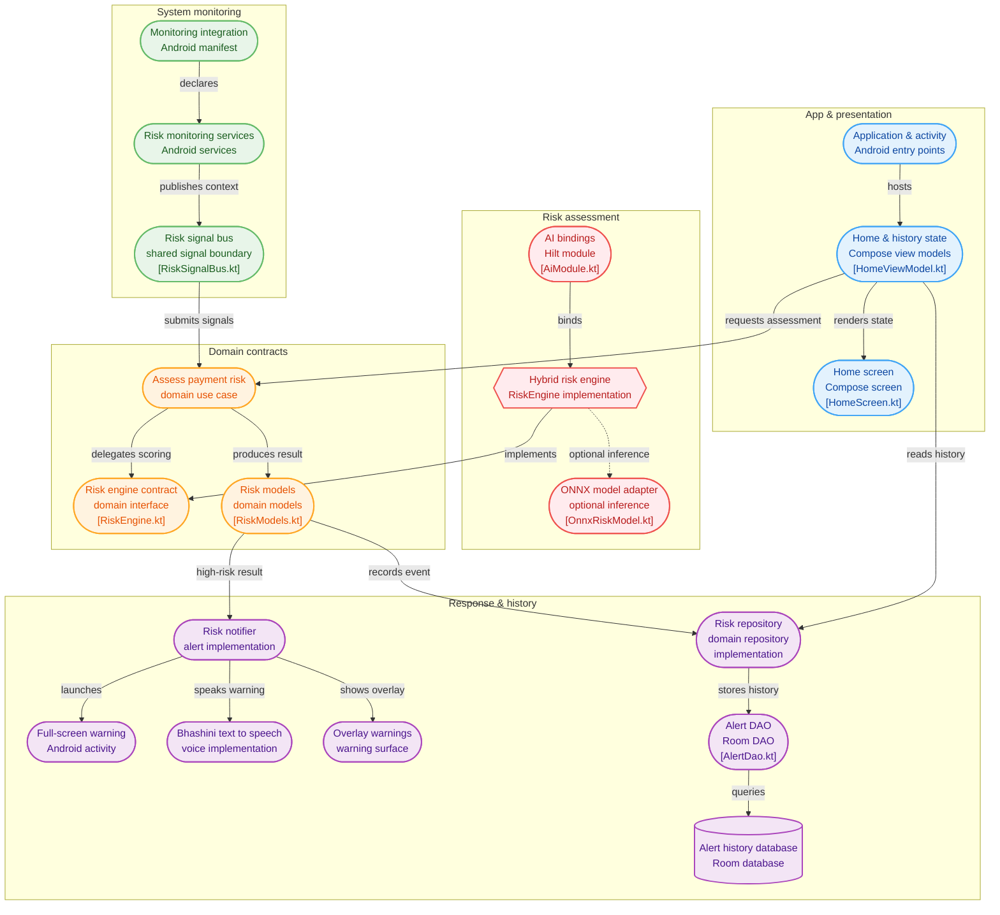

### 🚨 Pre-PIN Prevention Workflow

How GramKavach stops fraud before money leaves the account:

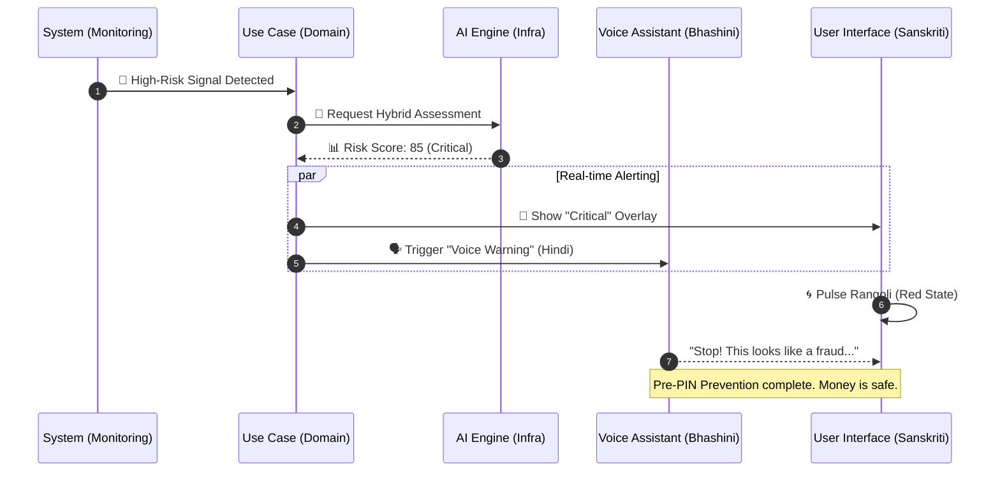

See [Architecture.md](docs/Architecture.md) and [Workflow.md](docs/Workflow.md) for more details.

## ⚙️ Installation

1. Open this directory in **Android Studio Ladybug** (2024.2.1) or newer.
2. Ensure you have **JDK 17** and **Android SDK Platform 35** installed.
3. Let Gradle sync, then run the `app` configuration on an **Android 8.0 (API 26)+** device.

### Bhashini Setup (Optional)
For voice synthesis, set the following in your global `gradle.properties`:
```properties
BHASHINI_USER_ID=your_user_id
BHASHINI_API_KEY=your_api_key
BHASHINI_BASE_URL=https://dhruva-api.bhashini.gov.in/
```
If credentials are unavailable, GramKavach automatically falls back to the device's default Text-to-Speech engine.

## 📱 In-App User Guide
GramKavach contains a built-in 4-step guide to help new users understand the safety features:

| 1. Real-time Monitoring | 2. Smart Risk Analysis |
| :--- | :--- |
| 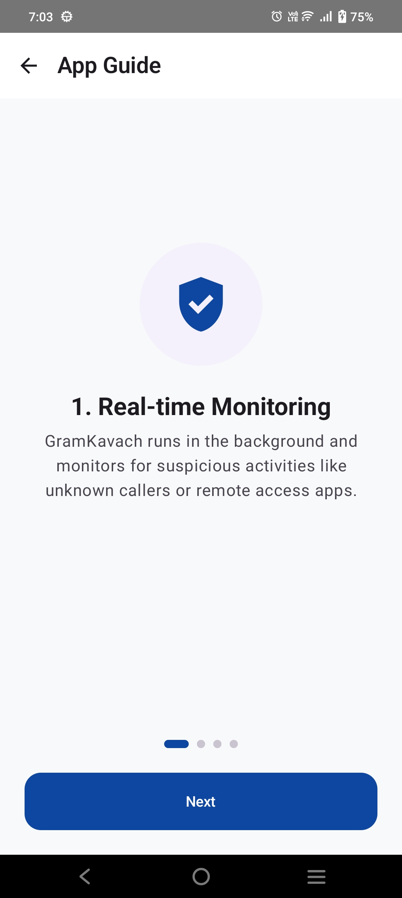 | 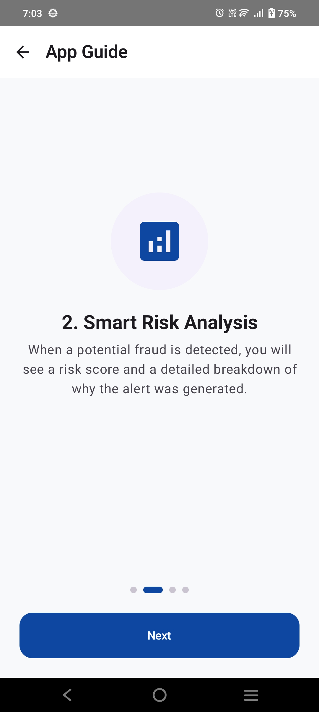 |
| **3. Local Voice Alerts** | **4. Emergency Reporting** |
| 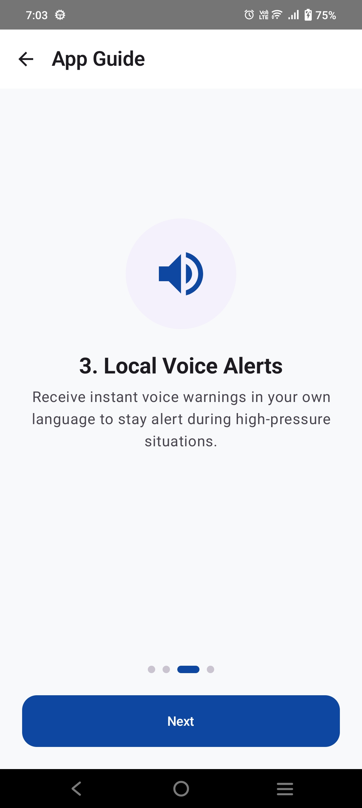 | 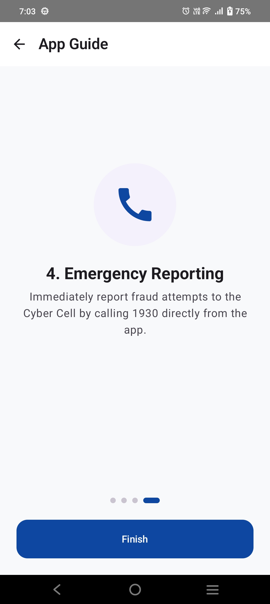 |

---

## 📸 Screenshots

Explore the GramKavach interface and dynamic safety alerts:

### 🛡️ Dashboard & Risk States
| Safe Status | Caution Alert | High Risk |
| :--- | :--- | :--- |
| 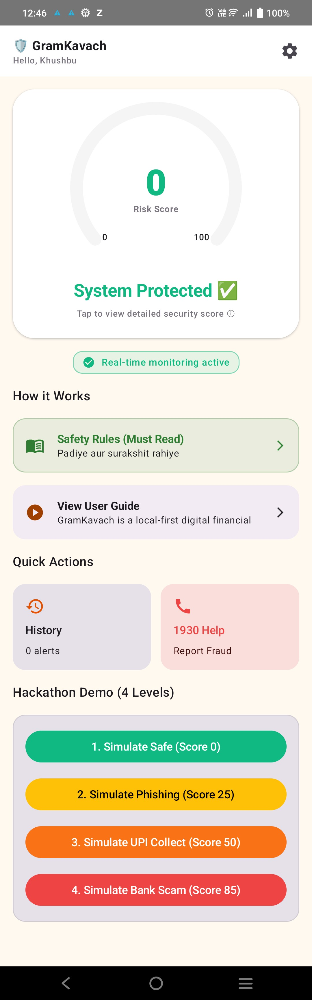 | 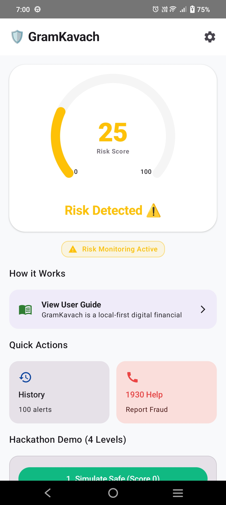 | 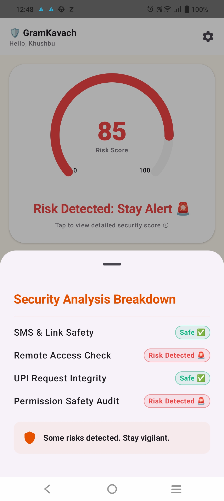 |

### 🚨 Real-time Alerts
| Warning Overlay | Moderate Alert | History Log |
| :--- | :--- | :--- |
| 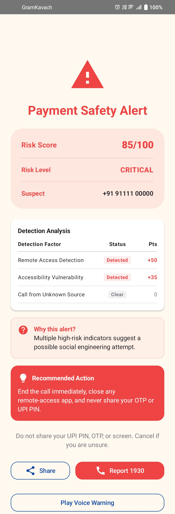 | 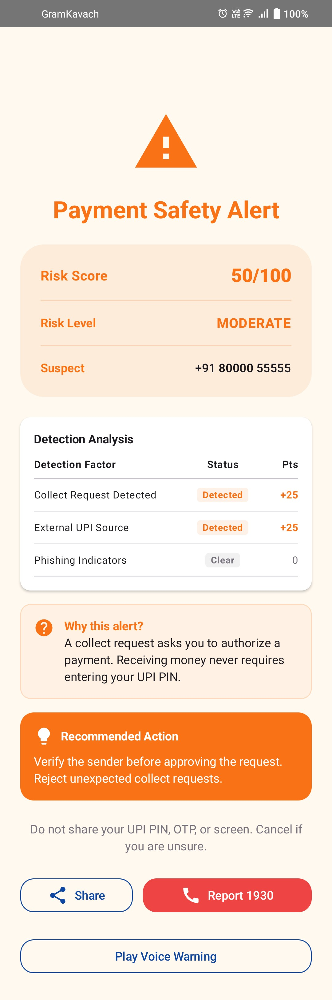 | 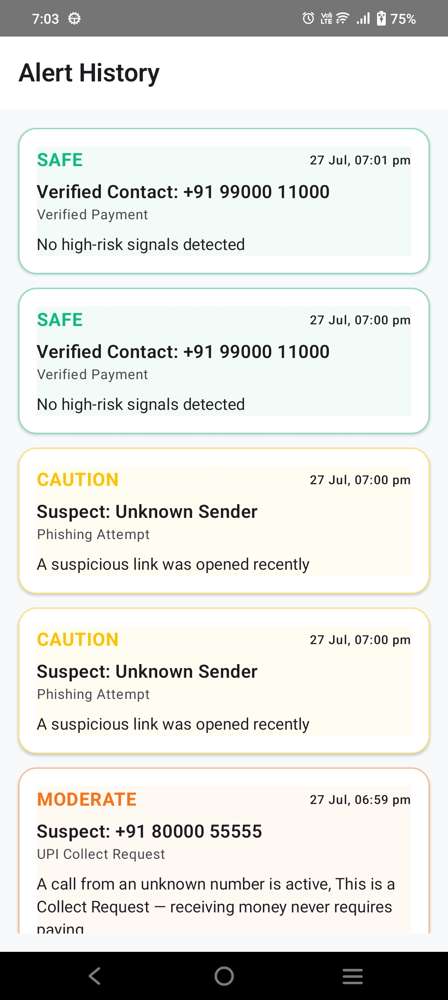 |

### ⚙️ Settings & App Info
| My Profile | Settings | About GramKavach |
| :--- | :--- | :--- |
| 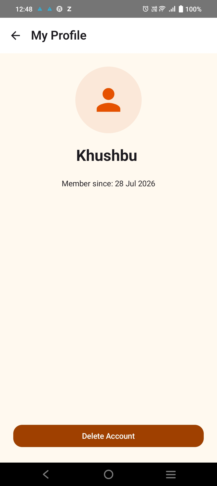 | 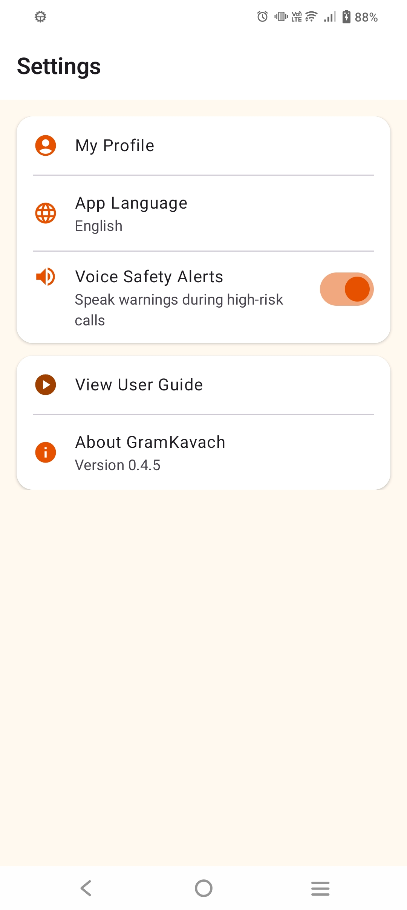 | 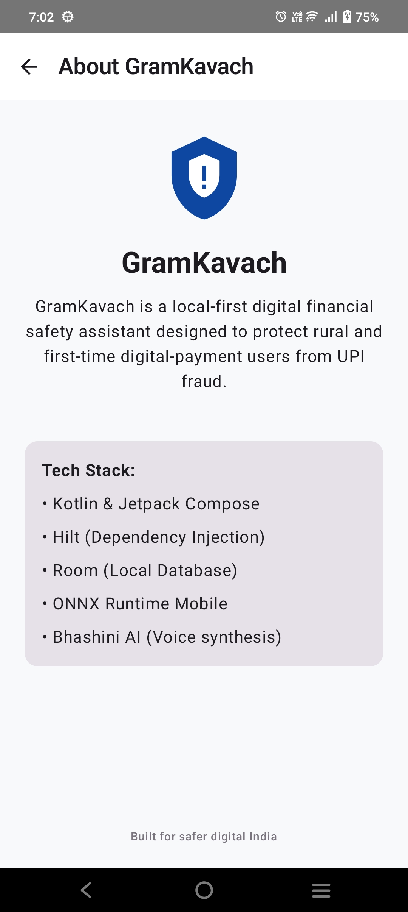 |

---

## ⚠️ ONNX Model Disclaimer

> [!WARNING]
> **Production Model Status**: `OnnxRiskModel` is a template for executing ONNX models. A real production-grade fraud model is not included as it requires training on representative, consented datasets. The current "Demo Mode" uses a hybrid rule-based risk engine for safe simulation.

## 🔮 Future Scope

- Validated and calibrated ONNX model deployment.
- Offline local language packs for low-connectivity regions.
- Encrypted exportable incident reports for law enforcement.
- Community-based usability testing in rural clusters.

## 👨‍💻 Developer

**Khushbu Prajapati** 

Solo Developer  
Government Engineering College, Patan

GitHub: https://github.com/kgp134134-sys

## 🙏 Acknowledgments

This project was built from my own idea, concept, planning, and hard work. AI tools helped with code generation, debugging, improvements, and documentation.

> 🤖 AI assisted during development. The idea, concept and project design are original.

## 📄 License

MIT — see [LICENSE](LICENSE).
