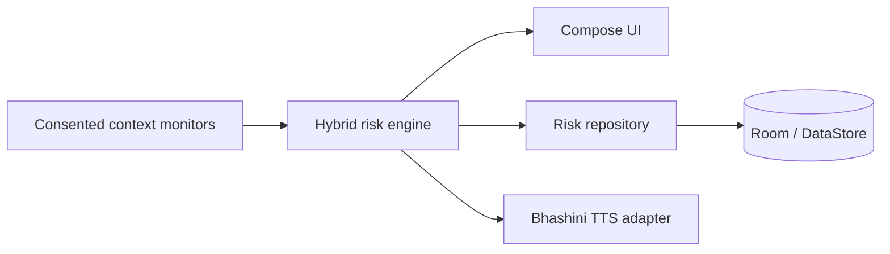

# GramKavach

> AI-powered digital financial safety assistant for preventing UPI fraud.

## 📥 Download & Demo

**Get the latest hackathon-ready build here:**
[**Download GramKavach APK**](https://github.com/YOUR_GITHUB_USERNAME/YOUR_REPO_NAME/releases/download/v1.0.0-demo/app-debug.apk) *(Note: Replace with your actual GitHub release link)*

**Hackathon Highlights:**
- **Full Localization**: Support for 7+ Indian languages (Hindi, Marathi, Gujarati, Bengali, Tamil, Telugu, English).
- **Explainable AI**: Dynamic "Detection Analysis" table explaining risk scores.
- **Winner Dashboard**: Real-time pulsing risk gauge and safety status.

## Overview

GramKavach helps rural and first-time digital-payment users recognise fraud **before** they authorize a payment. It combines consented device-context signals with local rule and ML-ready scoring, then explains risk in the user’s language.

## Problem and solution

Fraudsters exploit fake QR codes, Collect Requests, phishing, remote-control apps, and social engineering. GramKavach turns relevant signals into a simple warning: stop, verify the recipient and amount, and never share a UPI PIN or OTP.

## Features

- **100% Deep Localization**: The entire UI and dynamic alert data (reasons, history) automatically translate into 7+ Indian languages.
- **On-Device Explainable AI**: Hybrid risk scoring that provides a "Detection Analysis" breakdown for every alert.
- **Real-time Safety Overlay**: A pulsing floating badge that warns users during high-risk calls or payment requests.
- **Bhashini Voice Alerts**: Localized voice commands powered by Bhashini AI (with Android TTS fallback).
- **Winner Dashboard**: Dynamic risk gauge with 0-100 markers and hackathon-grade animations.
- **Emergency Reporting**: Quick-dial shortcut to **1930 Cyber Cell** for immediate fraud reporting.
- **Privacy First**: Permission-conscious monitoring; no transaction interception or PIN collection.

## Tech stack

Kotlin, Jetpack Compose, Material 3, MVVM/Clean Architecture, Hilt, Room, DataStore, Coroutines/Flow, ONNX Runtime Mobile, JUnit.

## Architecture

See [Architecture.md](docs/Architecture.md) and [Workflow.md](docs/Workflow.md).

## Installation

1. Open this directory in Android Studio Ladybug or newer.
2. Use JDK 17 and install Android SDK Platform 35.
3. Let Gradle sync, then run the `app` configuration on an Android 8.0+ device/emulator.

For voice synthesis, set `BHASHINI_USER_ID` and `BHASHINI_API_KEY` in your user Gradle properties. When the Bhashini service, credentials, or network are unavailable, GramKavach uses the Android device's installed Text-to-Speech engine. Grant notification and phone-state permission only if you want those contextual safety signals. Accessibility monitoring must be enabled explicitly from Android Settings.

Detailed setup: [Installation.md](docs/Installation.md).

## Usage

Open **Try payment safety check** to see a sample risk explanation. Production integrations publish only permissioned context signals; they do not access UPI PINs or override another app’s payment screen.

## 📱 In-App User Guide (App Onboarding)
GramKavach में नए यूज़र्स को आसानी से समझाने के लिए 4-स्टेप इन-ऐप गाइड शामिल है:

| 1. Real-time Monitoring | 2. Smart Risk Analysis |
| :--- | :--- |
|  |  |
| **3. Local Voice Alerts** | **4. Emergency Reporting** |
|  |  |

## Screenshots

Add validated device screenshots to `screenshots/` before publishing the repository. Accessibility monitoring is optional and observes only foreground package names to identify known remote-control apps; it never reads window contents.

## Testing

Run `gradlew.bat test` for local unit tests and `gradlew.bat connectedAndroidTest` on a connected device/emulator for the Compose navigation smoke test. This workspace could not execute Gradle, so contributors must run these commands before release.

## ONNX model

`OnnxRiskModel` executes a production ONNX model with a single `[1,6]` float input and scalar probability output. A real fraud-detection model is not included because a model must be trained, evaluated, calibrated, and approved with representative consented data. Do not ship a fabricated “demo” model as fraud protection.

## Future scope

Validated ONNX model, Bhashini credential-backed TTS, local language packs, encrypted exportable incident reports, and usability testing with target communities.

## Team members

Add project contributors here.

## License

MIT — see [LICENSE](LICENSE).
