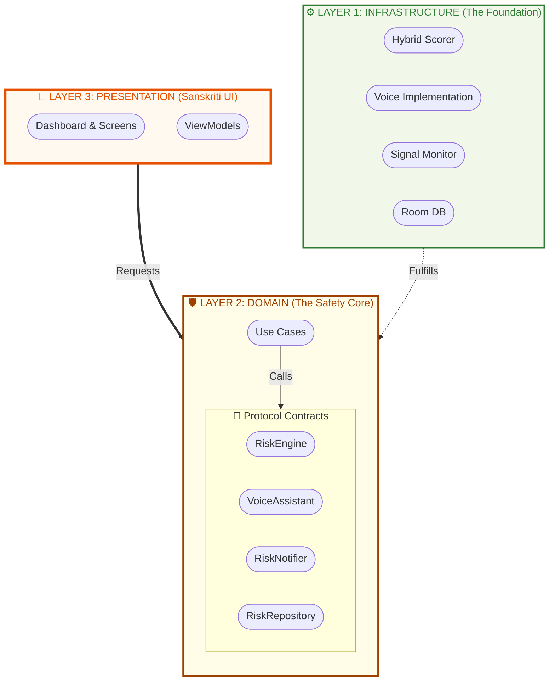

# Architecture: The Safety Fabric

GramKavach is built on a modular, domain-centric architecture that ensures scalability, testability, and a clear separation of concerns.



## Data Signal Pipeline (ASCII Detail)

This diagram shows how a raw risk signal travels through the layers to become a user alert.

```text
[ HARDWARE/SYSTEM ]        [ INFRASTRUCTURE ]        [ DOMAIN ]             [ PRESENTATION ]
        │                          │                    │                         │
  ┌─────▼─────┐             ┌──────▼──────┐      ┌──────▼──────┐           ┌──────▼──────┐
  │ Monitoring│  =========> │  Signal Bus │ ===> │ Use Case    │ =========>│ Sanskriti   │
  │ Service   │  (context)  │  (filtering)│      │ Logic       │ (UI State)│ Dashboard   │
  └───────────┘             └─────────────┘      └──────┬──────┘           └──────┬──────┘
                                                        │                         │
                                                 ┌──────▼──────┐           ┌──────▼──────┐
                                                 │  Contracts  │           │ Bhashini    │
                                                 │ (Interfaces)│ <======== │ Voice Alert │
                                                 └─────────────┘           └─────────────┘
```

## Layer Breakdown
- **🛡️ Domain Layer (`:domain`)**: Pure Kotlin. The absolute source of truth. Contains `UseCases` that define *what* the system does.
- **📱 Presentation Layer (`:app`)**: Built with Jetpack Compose. Implements the "Sanskriti" design system and manages UI state.
- **⚙️ Infrastructure Layer**: Implementations of domain contracts. 
  - `:ai` handles ML (ONNX).
  - `:bhashini` handles linguistic diversity.
  - `:monitoring` watches for system-level fraud signals.

Sensitive information is not uploaded by this starter. Production telemetry must be opt-in, minimized, encrypted, and governed by a reviewed retention policy.
