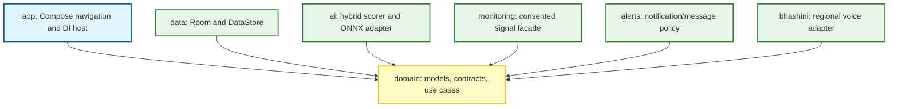

# Architecture

GramKavach uses a dependency direction that keeps UI and device-specific code outside the business model.

- `domain` is pure Kotlin business logic.
- `data` owns device persistence and implements repository contracts.
- `ai` is local-first. Rules remain available if an ML model cannot load.
- `monitoring` is event-driven; it must never poll aggressively or bypass Android permission boundaries.
- `app` owns screen composition and navigation.

Sensitive information is not uploaded by this starter. Production telemetry must be opt-in, minimized, encrypted, and governed by a reviewed retention policy.
